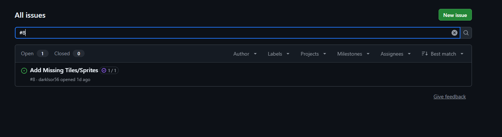
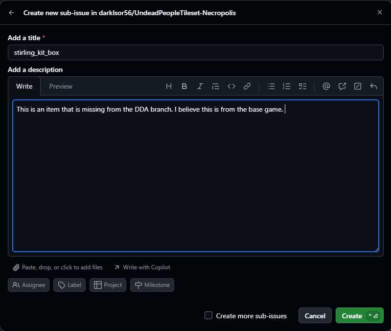
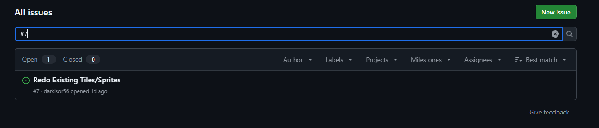
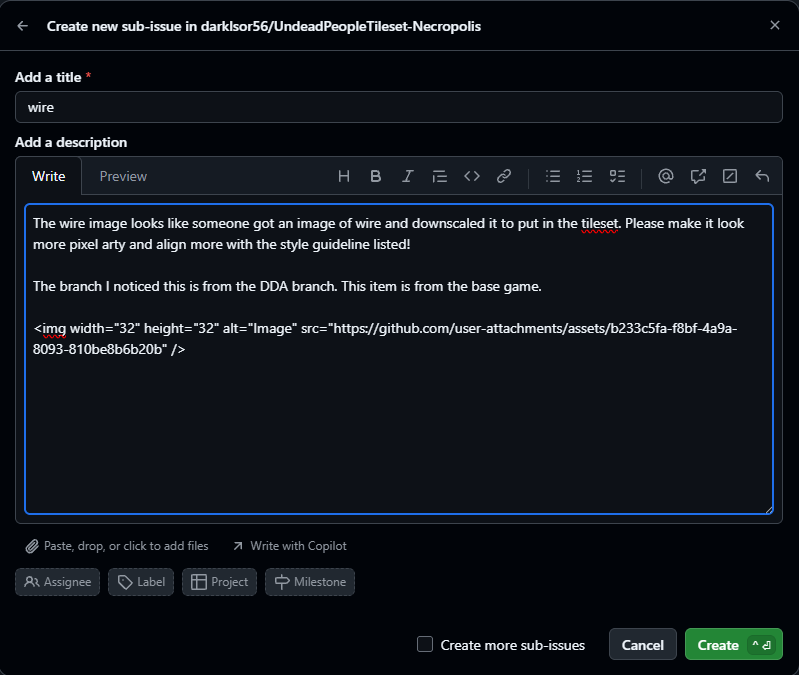
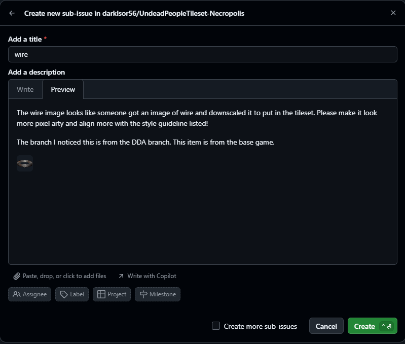

# Summary
Here is where you can find the ideal way to leave an issue. 

Now, the template here is more a guide than a concrete set of rules. Meaning, please don't feel discourged to make an issue if something in this guide/template doesn't meet or answer specific questions you may have. If we need more info to understand the problem, we will just send a comment to you in the issue to get things sorted.

## Requesting an image for a tile/sprite that doesn't have one

First, find issue #8 called `Add Missing Tiles/Sprites`.

Then click the issue link and read it. If you see no one has submitted an issue for your images associated `id`, then create a sub-issue. Make the title the `id` and make the description give general details of what the image is and for what branch or mod of cataclysm this is for. The aim is to prioritize images for the latest stable branch of Cataclysm: Dark Days Ahead, but issues can be made for other branches and mods if requested, but note, they will generally have a lower priority.

> What is an `id`?: An `id` is the games entity ID and can be found either in debug mode or the hithikers guide in the Raw JSON section for CDDA.
> This tells us the actual debug name that we need so we can make the image for your issue!

## Requesting an image be changed
The process is very similar to when requesting an image. except you want to make your sub-issue in issue #7: `Redo Existing Tiles/Sprites`.

The title is the same as before, just put the item `id`. You still want to note in the description what branch the image is from and if it's an item, monster, ect. Where things become different is you want to note that you are requesting the image be changed and why. The main reason an image may want to be changed is because it does not match the style of this pack. These issues will get a comment either approving of the change needed or telling you why the item will not be getting a revision. Ideally, you will then be given a period of time to respond elaborating your reason if misunderstood by about three days. After wich, the issue will be closed if no case can be made. If you see an item that was denied a revision, but you truly feel that the item does need one, put in another issue following this guide, but place a number at the end of the title (ex: `wire_barbed_2`, `wire_barbed_3`, ...).

 

## Other
If you find something else wrong with the tileset like a script not working or a more fundemental problem plauging the art, feel free to make a normal issue. For this, just copy the format from the CDDA's `ISSUES.md` guide [here](https://github.com/CleverRaven/Cataclysm-DDA/blob/master/ISSUES.md).

Make your issue to the best of your ability and press create. If you make mistakes, we will try to work with you to the best of our ability. I only really want to close possibly legitimate issues early if I have no idea what I am working with and I am getting no meaningful communication to work with.

Thank you for reading and possibly helping out in fleshing this tileset further and further into completeion.